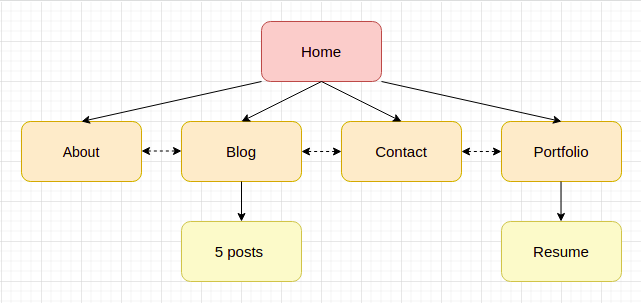
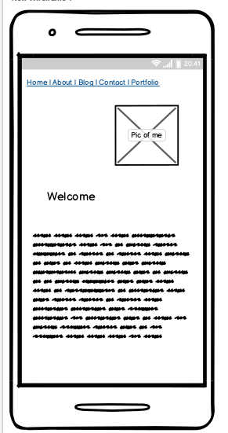
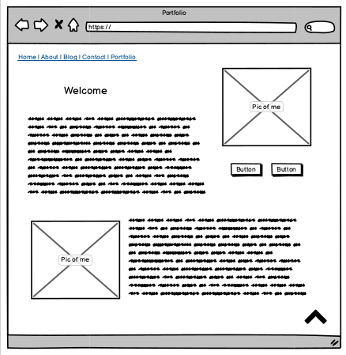
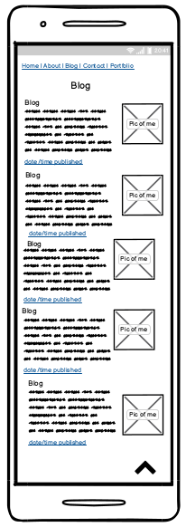
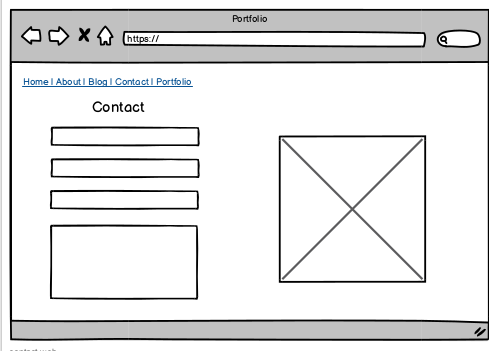
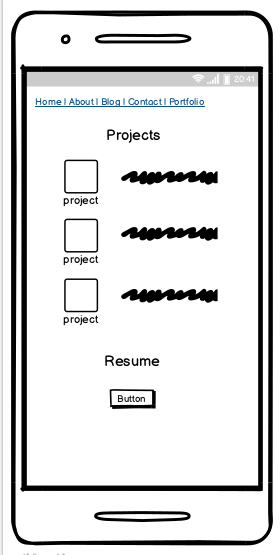

# **NaomiHeath_T1A2**
    Portfolio Website Coder Academy T1A2

[link to live site](https://www.naomigrh.com)

[link to github](https://github.com/naomigrh/NaomiHeath_T1A2/)

# **Description**
    This **Portfolio Website** is a *demonstration of skills* learned during the first few weeks of Coder Academy Flextrack Bootcamp. It features *several pages linked together* with a cohesive theme including some personal and professional background of the developer. Utilising *mobile-first design,* the aim is to create a *responsive* site for better user experience. The **Portfolio Website** will be used to showcase current and ongoing projects to *future employers*.

## **Purpose and Target Audience**
    The purpose of this site is assessment for Coder Academy. It will be updated to continue showing progress of my work and education. The target audience is future employers and colleagues who may be interested in learning more about me or connecting professionally or socially. 

## **Functionality/Features**
    - Responsive design: ease of use on all devices
    - Simple aethetic: showcase content
    - Easy to navigate: nav bar and links allow access to most of my site within 2 clicks
    - Professional and Personal content: indicates some professional history as well as personality
    - Contact methods: several way to connect professionally and socially

## **Sitemap**

Sitemap shows an overview of planned pages for the site. All linked via navigation bar and additional links in text.

    1. Home:
        - main/landing page 
        - links to other pages via nav bar
        - additional hyper links in introduction about author
    2. About:
        - additional information about author 
        - interests and personality
    3. Blog:
        - 5 sample blog post previews
        - date and time published 
        - link to separate post.html file
       
        3a. 5 Posts:
            - example full blog post
            - date and time published
            - link back to main Blog page
    4. Contact
        - Contact form 

    5. Portfolio
        - current tech stack and skill set
        - upcoming and ongoing projects
        - link to pdf resume

        5a. Resume
        - pdf resume (mock up)

## **Screenshots**
Selected screenshots of wireframes so as to not overload document. Additional screenshots located in /docs including pdf of all sitemap and wireframes.

Home- Mobile

About- Desktop

Blog- Mobile

Contact- Desktop

Portfolio- Mobile

## **Tech stack**

### **Development**
    - HTML
    - CSS
    - Netlify

### **Version Control**
    - Git

### **Git Hosting**
    - Github 
[link to github](https://github.com/naomigrh/NaomiHeath_T1A2/)   

### **Code Editor**
    - VS (Virtual Studio) Code

### **Deployment**
    - Netlify
[link to netlify](https://app.netlify.com/sites/naomigrh/overview)

### **Security**
    - 

## **Attribution**

### **Images**
    - icons sourced by Icon Finder [link to iconfinder](https://www.iconfinder.com/)
    - free to use icons used only
    - picart sourced by Pic Crew Image Generator
